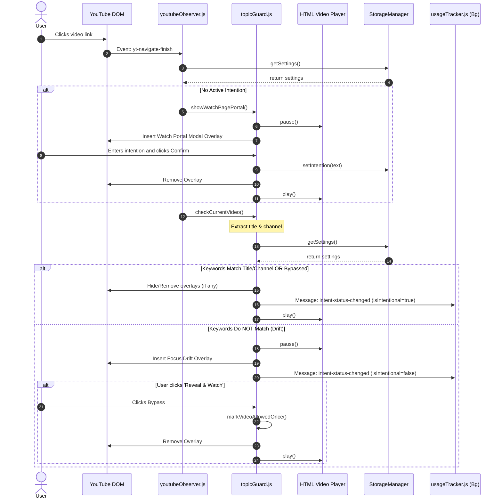

# Intentional YT - Architecture and Features

This document provides a comprehensive, step-by-step guide to the architecture, component roles, data flows, and features of the **Intentional YT** browser extension. 

---

## 1. Architectural Overview

Intentional YT is designed as a **dark-mode-first, intent-driven YouTube companion** browser extension (Firefox WebExtension, Manifest V2). Rather than allowing passive scrolling and algorithmic recommendation consumption, it actively restricts distracting surfaces and forces intentionality through overlays and usage metrics.

```mermaid
graph TD
    subgraph Browser Popup UI
        popup[popup.html / popup.js] <--> storage[(browser.storage.local)]
    end

    subgraph Background Service Scripts
        scheduler[scheduler.js] -. Listen for tab updates & alarms .-> browserEvents[WebExtension Event API]
        usageTracker[usageTracker.js] <-- Track active watch sessions --> contentCoord
        usageTracker --> storage
    end

    subgraph Content Scripts (Injected into YouTube)
        contentCoord[youtubeObserver.js] --> blocker[recommendationBlocker.js]
        contentCoord --> guard[topicGuard.js]
        contentCoord --> overlay[timerOverlay.js]
    end

    guard -. Injects overlay on mismatch .-> player[YouTube Video Player]
    overlay -. Injects ambient banner & break overlay .-> player
    blocker -. Hides recommendations & shows intent entry .-> page[YouTube DOM]
    
    storage <--> guard
    storage <--> blocker
    storage <--> overlay
```

---

## 2. Directory and File Structure

Below is the file layout of the extension. It uses a dual JavaScript/TypeScript model where `.ts` files house the typed source, but the `manifest.json` loads the compiled/synchronized `.js` files.

```text
intentional-yt/
├── manifest.json                   # Extension configuration and permission declarations
├── README.md                       # High-level overview
├── styles/
│   └── ui.css                      # Unified style sheet (dark-mode-first, glassmorphism)
├── utils/
│   ├── storage.js / .ts            # Unified storage manager (settings, stats, history)
│   └── time.js / .ts               # Formatting, cooldowns, duration computations
├── background/
│   ├── scheduler.js / .ts          # Alarm scheduler and Shorts page interceptor
│   └── usageTracker.js / .ts       # Session state tracker (processes video events)
├── content/
│   ├── youtubeObserver.js / .ts    # Content script coordinator and event router
│   ├── recommendationBlocker.js/.ts# Injects block styles & builds Home Intent Portal
│   ├── topicGuard.js / .ts         # Checks title matching, blocks video, shows Drift UI
│   └── timerOverlay.js / .ts       # Handles ambient timer and Breathing Breaks modal
└── ui/
    ├── popup.html                  # Popup Control Panel layout
    ├── popup.js / .ts              # Popup logic (syncs state, handles manual inputs)
    ├── modal.html                  # Dormant modal page (Web Accessible Resource)
    └── modal.js                    # Controller for dormant modal.html
```

---

## 3. Core Features (Step-by-Step Flows)

### Feature A: Recommendation & Distraction Blocker
*   **Purpose**: Prevents entering YouTube rabbit holes by proactively hiding algorithm-driven sections.
*   **Step-by-Step Flow**:
    1.  On initial document parsing, `content/recommendationBlocker.js` executes at `document_start` to inject a stylesheet containing strict `display: none !important` rules.
    2.  This stylesheet targets and hides the home feed grids, watch page related sidebar suggestions, end screen recommendations, Shorts racks, and trending links.
    3.  Auto-play is forcefully disabled by programmatically clicking the YouTube autoplay toggle button and stripping the `autoplay` attribute from the video element.

### Feature B: The Home Page Mindful Intent Portal
*   **Purpose**: Replaces the blank homepage feed with a productivity dashboard.
*   **Step-by-Step Flow**:
    1.  `youtubeObserver.js` detects that the URL matches a YouTube homepage variant.
    2.  `recommendationBlocker.js` injects the **Mindful Intent Portal** at the top of the content area.
    3.  The portal displays:
        *   An input field asking the user for their current intention.
        *   A progress ring visualizing the user's **Intentionality Index** (Intentional Time vs. Aimless Time).
        *   Quick links (pills) containing recent search intentions from history to quickly resume tasks.
    4.  Submitting an intention saves it to local storage as the active intention, fires a state change message, and redirects the user directly to the search page for that query.

### Feature C: Watch-Page Intention Gatekeeper (Topic Guard)
*   **Purpose**: Prevents drifting from the target topic when viewing search results.
*   **Step-by-Step Flow**:
    1.  When navigating to a video (`/watch`), `youtubeObserver.js` queries `StorageManager` to verify if there is an active intention.
    2.  If **no active intention** exists, the video player is blocked by a fullscreen **Watch Portal Overlay** that forces the user to write an intention before playing the video.
    3.  If an **active intention exists**, `topicGuard.js` extracts the video title and channel name.
    4.  It normalizes and tokenizes both strings, comparing them against keywords in the active intention.
    5.  **Relevance Found**: The video plays normally, and content scripts notify the background scripts of an intentional watch.
    6.  **Relevance Mismatch (Drift)**: The video player is paused, and a **Focus Drift Detector** overlay is rendered.
        *   The user can choose:
            *   *Go Back*: Redirects to the search results of the active intention.
            *   *Update Intention*: Type a new intention to transition focus.
            *   *Reveal & Watch (Bypass)*: Allows watching the drifted video as an exception (tracked in `sessionStorage` to avoid continuous alerts on the same page, but reported to the background tracker as *aimless watch*).

### Feature D: Ambient Banner & Breathing Breaks
*   **Purpose**: Keeps the user mindful of time and interrupts binge-watching.
*   **Step-by-Step Flow**:
    1.  During an active watch session, an **Ambient Banner** is floating at the top-right corner of the video viewport showing the current focus topic and session duration.
    2.  A dropdown gear menu on the banner lets the user change or clear the intention dynamically.
    3.  While a video plays, `timerOverlay.js` tracks accumulated continuous watch seconds.
    4.  When watch time reaches the configured breathing break interval (default: 20 minutes):
        *   The video is paused.
        *   A fullscreen **Mindful Check-in** overlay appears.
        *   An animated circle expands and contracts, prompting the user to follow an inhale-hold-exhale sequence for 30 seconds.
        *   After 30 seconds, options appear: "Yes, Keep Watching" (resumes playback) or "No, Close YouTube" (clears intent and redirects home).

---

## 4. Component-by-Component Architecture

### 4.1. Shared State and Storage (`utils/storage.ts`)
The `StorageManager` coordinates local data using `browser.storage.local`. Key configurations include:
*   `extensionEnabled` (boolean): Master extension switch.
*   `activeIntention` (string): Active search/focus topic.
*   `intentionStartTime` (timestamp): Start of the active focus session.
*   `intentionHistory` (array): List of completed sessions containing intention text, duration, and date.
*   `breathingBreaks` (object): Configures whether breaks are enabled and their interval.
*   `shortsBlocked` (boolean): Toggles redirection of `/shorts/` urls.
*   `stats` (object): Accumulates today's watch metrics: `todayWatchTime`, `todayIntentionalTime`, `todayDriftTime`.

> [!NOTE]
> `StorageManager` automatically resets `stats` on settings load if it detects the calendar day has changed compared to `stats.lastStatsReset`.

---

### 4.2. Coordinator (`content/youtubeObserver.ts`)
Since YouTube is a Single Page Application (SPA), traditional page-load event hooks do not fire upon navigation. 
*   `youtubeObserver.js` listens to custom YouTube custom events: `yt-navigate-start`, `yt-navigate-finish`, `yt-page-data-updated` and `popstate`.
*   Upon detecting route transitions, it performs DOM selectors analysis to route control logic:
    *   `/watch` paths call `handleWatchPage()` to activate `TopicGuard` and `TimerOverlay`.
    *   `/results` paths call `handleSearchResultsPage()` to display search layouts.
    *   Other paths call `handleNonWatchPage()` to clean overlays and mount the Home Intent Portal.
*   It tracks user activity (clicks, scrolls, keypresses) and pings the background usage tracker every 15 seconds to ensure tracking stays active.

---

### 4.3. Background Trackers (`background/`)
*   **`usageTracker.js`**: Receptive to events from content scripts (`session-start`, `video-started`, `video-paused`, `video-ended`, `activity`, `intent-status-changed`). It calculates precise play intervals and increments storage metrics accordingly.
*   **`scheduler.js`**:
    *   Listens to `browser.tabs.onUpdated`. If a tab URL points to `/shorts/` and Shorts Blocking is enabled, it forces a redirect to the standard homepage.
    *   Registers a `daily-reset` alarm utilizing the WebExtension Alarms API to clear daily metrics at midnight.

---

### 4.4. Control Popup UI (`ui/popup.js`)
The extension panel serves as the user-facing settings center:
1.  **State Synchronization**: Checks `StorageManager` to toggle the extension switch and Shorts blocking.
2.  **Session Info**: Shows active focus duration, or lets the user set an intention directly from the popup.
3.  **Visualization**:
    *   Renders a circular SVG progress ring demonstrating the percentage of watch time spent intentionally.
    *   Calculates and formats watch statistics (Intentional, Drift, and Total Watch time).
    *   Populates a scrollable history timeline for today's intentions.
4.  **Toggles**: Configures breathing break intervals (15 mins, 20 mins, 30 mins, or Off).

---

## 5. Sequence Diagram: Video Navigation & Guard Evaluation

This diagram details the sequence of execution when a user clicks a video:



---

## 6. Architectural Details & Mismatches

> [!WARNING]
> There are two key discrepancies between documentation (`README.md`) and the active source code:
>
> 1.  **Dormant Assets**: `ui/modal.html` and `ui/modal.js` exist in the workspace, but are not imported or opened by any active component. The extension uses fully integrated DOM element overlays injected by content scripts instead of external HTML windows.
> 2.  **Legacy Feature Mentions**: The `README.md` details features like *Night Lock*, *Research vs Entertainment Mode*, and *Browsing Mode*. However, these files are not present in the current runtime structure (e.g., `browsingMode.js` is absent). The current active codebase revolves around a cleaner, unified **Intent-First Focus Session** approach (Intention entry -> keyword relevance checks -> drift overlay / breathing break alerts).
